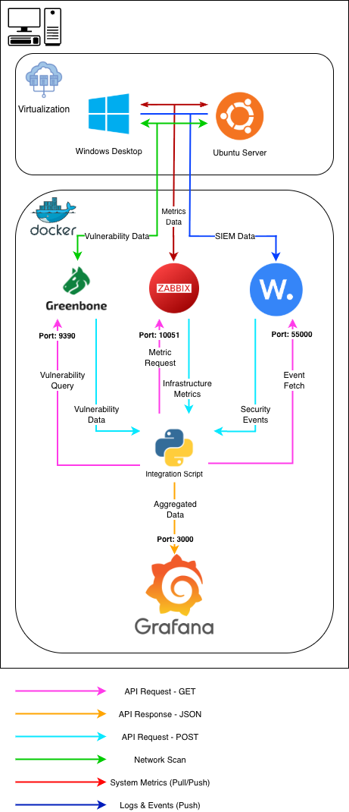

# Implementace open-source technologií pro monitoring a bezpečnost IT infrastruktury

Tento repozitář obsahuje projekt k diplomové práci na téma zhodnocení a implementace monitorovacích a bezpečnostních nástrojů.

## Abstrakt
Cílem práce je zhodnotit možnosti využití open-source nástrojů pro zajištění monitoringu a bezpečnosti IT infrastruktury. Práce se zaměřuje na návrh a realizaci řešení, které umožní sběr a vyhodnocování dat z různých zdrojů. Součástí je i zpracování výsledků do podoby přehledných reportů nebo dashboardů.

## Architektura řešení
Navržený systém využívá integraci nástrojů **Greenbone** (vulnerability scanning), **Zabbix** (monitoring metrik) a **Wazuh** (SIEM/logy). Data jsou agregována pomocí integračního skriptu v Pythonu a vizualizována v nástroji **Grafana**.

## Zásady pro vypracování
1. Zhodnotit dostupné Open-Source nástroje z pohledu bezpečnosti a monitoringu.
2. Navrhnout architekturu pro monitoring a bezpečnost IT infrastruktury.
3. Implementovat řešení v testovací infrastruktuře (Docker, Ubuntu Server, Win10).
4. Vytvořit integraci pro agregaci dat a jednotný výstup.
5. Otestovat funkčnost a zabezpečení celého řešení.

---
**Autor:** Bc. Alexandr Tomeček  
**Vedoucí práce:** Ing. David Malaník, Ph.D.  
**Akademický rok:** 2025/2026